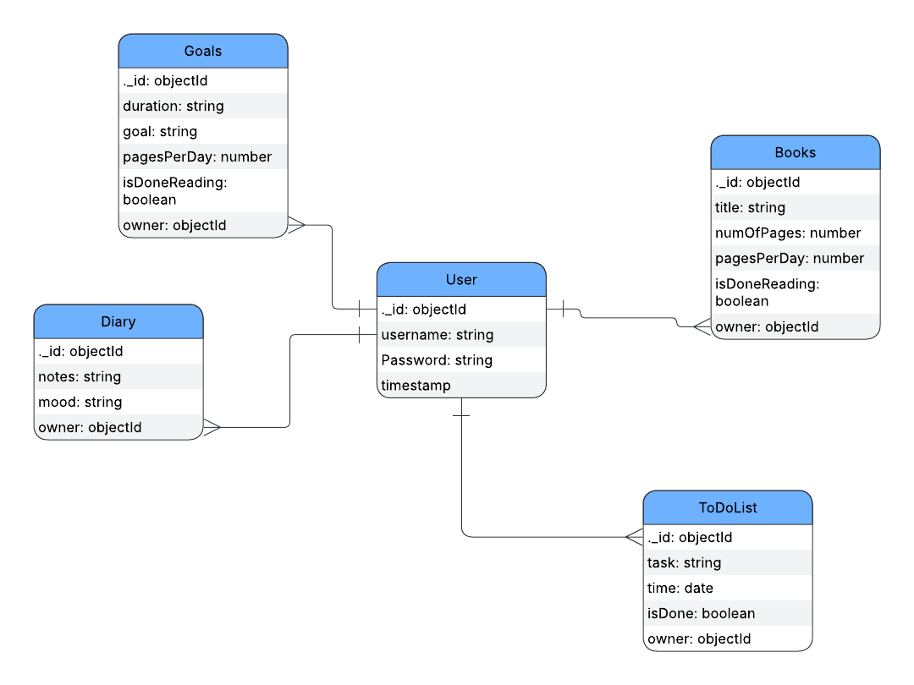

# SoftSchedule

## Date: 10/1/2025

### By: Balqees Alawi, Jameela Mohamed, Hawraa Mohamed

#### GitHub: [balqeesalawi](https://github.com/balqeesalawi) | [jamsaeed](https://github.com/jamsaeed) | [HawraAlaam](https://github.com/HawraAlaam)
***

### ***Description***
#### SoftSchedule is your gentle companion in the chaos of everyday life. It’s a to-do list app built not just for productivity, but for peace of mind. You can easily create, update, and organize your tasks without feeling overwhelmed. The interface is warm and calming—like a cozy corner where your plans feel safe, not stressful. It includes a calendar with quotes, goal tracking, book management, to-do lists, and a diary with mood tracking. Users can sign up, log in, and manage their daily tasks, reading progress, and reflections all in one simple and clean interface.

#### [wireframe](https://www.figma.com/design/753jCDxxeTFSsPXpJWLWGa/Untitled?node-id=0-1&t=MbM5h7Hh03zt6Plz-1)
***

### ***Technologies Used***
* Git
   * GitHub
* VS code
  * HTML, CSS and JavaScript
* Framework
  * express
* Database
  * MongoDB
* Middlewares
  * mongoose
  * express-session
  * methodOverride
  * morgan
  * bcrypt
  * ejs

  ### ***apps used***
  * VS code
  * figma
  * trello
  * googleFonts
  * pintrest
  * flow & design

***

### ***Getting Started***

#### You have first to sign in and if yoy don't have an account sign up, once you sign in you will be able to use every functionality on the website.

***

### ***Screenshots***
#### ER Diagram

***
### Home page

*** 
### To-do-List page

***
### Book-list page

***

***
### Goal-page

***
### Dairy page

***

***
### Profile-Page

### ***Future Updates***
- [ ] Adding a pop Up reminder for daily tasks, books, and achieving goal
- [ ] Adding a calender and connecting it to daily tasks
- [ ] making the app more interactive with animation
- [ ] Adding more functionality
- [ ] Making the App more customizable
- [ ] Adding sticker
- [ ] expanding the App

***

### ***Credits***
[github](https://github.com/SEB-X-Bahrain/class_wiki)
[w3schools](https://www.w3schools.com/)
[mdn](https://developer.mozilla.org/en-US/)

#####
***
